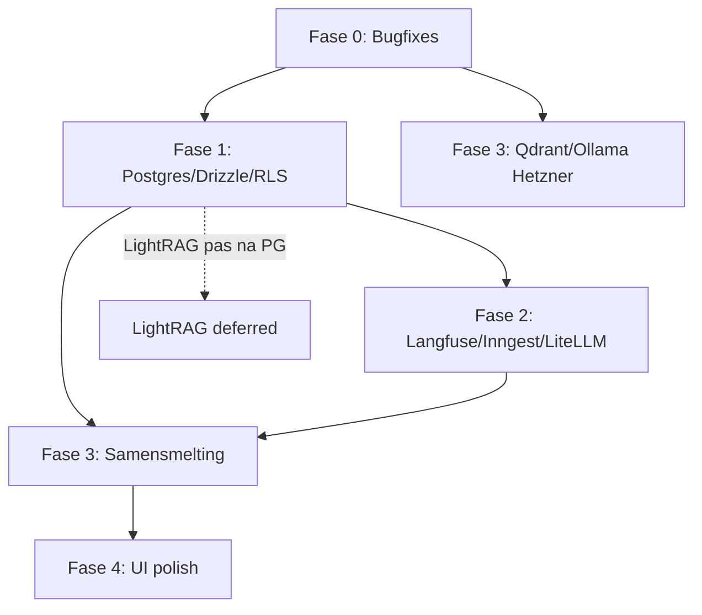

# Motor AI Factory OS — Master Build Plan

> **Versie:** 2026-06-06 · **Eigenaar:** Pietje · **Repo:** `AI_HQ/ai-motor`  
> **Gerelateerd:** [`DECISIONS.md`](DECISIONS.md) · [`hetzner-migration.md`](hetzner-migration.md) · [`hetzner-phase1.md`](hetzner-phase1.md) · [`WORLD_CLASS_CHECKLIST.md`](WORLD_CLASS_CHECKLIST.md)

---

## Executive summary

Motor AI Factory OS wordt een **team-first, opa-proof, mobile-first** white-label SaaS voor Nederlandse MKB-klanten (Fumero, Bokas, later meer). De huidige codebase (~45–50% UI, sterke interne basis) draait op een **NUC** met SQLite, OpenClaw als primaire chat-agent, en n8n als fallback — terwijl zware services gefaseerd naar **Hetzner** (8 vCPU, 16 GB RAM, 320 GB, €25,49/mo) verhuizen. Dit plan volgt een vaste volgorde: **(0) bugs fixen → (1) nieuwe structuur (Postgres/Drizzle/RLS) → (2) tech-adopties (Langfuse, Inngest, LiteLLM, …) → (3) samensmelting NUC+Hetzner → (4) UI & product polish**. Geen Mastra/VoltAgent/LangGraph/CrewAI, geen lokale 235B-modellen, geen Langfuse self-host op 16 GB — wel Qdrant-multitenancy, GDPR audit-events, en een unified model-routing-laag.

---

## Overzicht fasen

| Fase | Naam | Duur (indicatie) | Waar |
|------|------|------------------|------|
| **0** | Bugfixes & stabilisatie | 2–3 weken | NUC (+ bestaande Hetzner-services) |
| **1** | Nieuwe structuur | 4–6 weken | NUC dev → Hetzner Postgres |
| **2** | Nieuwe updates (tech-adopties) | 4–5 weken | Hetzner-first, NUC consumers |
| **3** | Samensmelting (hybrid architectuur) | 3–4 weken | NUC + Hetzner unified |
| **4** | UI & product polish | 4–6 weken | NUC (Next.js) + design system |

**Totale horizon:** ~17–24 weken (paralleliseerbaar na Fase 0).

---

## Fase 0: Bugfixes & stabilisatie

**Doel:** Chat-kennisbank, auth, approvals en bookkeeping weer betrouwbaar — zonder grote architectuurwijzigingen.

### Sprint 0.1 — Week 1: Qdrant-collecties & kennisbank

| # | Taak | Bestanden | Effort | Acceptatie |
|---|------|-----------|--------|------------|
| 0.1.1 | **Unificeer collectienaam-logica** — search gebruikt `factory_os`, ingest `factory_os_{klant}`, scrape `{klant}_kennisbank` | `lib/knowledge-search.ts`, `lib/knowledge-service.ts`, `app/api/qdrant/search/route.ts`, `lib/qdrant-collection.ts`, `lib/scrape/kennisbank-upsert.ts`, `lib/scrape/tenants.ts` | **M** | Chat preamble (`lib/chat-prompt.ts`) vindt ingest- én scrape-data voor fumero/bokas |
| 0.1.2 | **Migratie-script bestaande vectors** — snapshot oude collecties → nieuwe naming (`factory_os_fumero`, `factory_os_bokas`, optioneel alias scrape → unified) | `scripts/` (nieuw: `qdrant-migrate-collections.mjs`) | **M** | `GET /api/admin/integration-readiness` toont juiste collecties; smoke chat met kennisbank-treffer |
| 0.1.3 | **UI-labels synchroniseren** | `components/kennisbank-search.tsx`, `components/kennisbank-file-ingest.tsx` | **S** | UI toont actuele collectienaam uit env/helper, geen hardcoded `factory_os` |
| 0.1.4 | **Documenteer env-vars** | `docs/model-config.md`, `.env.example` | **S** | `QDRANT_COLLECTION_PREFIX`, per-tenant overrides gedocumenteerd |

**Beslissing:** zie [**ADR-001 dual-search**](DECISIONS.md#adr-001--qdrant-dual-search-geen-unified-collectie) — geen merge; search fan-out naar ingest + scrape collecties.

### Sprint 0.2 — Week 2: SQLite-schema & auth

| # | Taak | Bestanden | Effort | Acceptatie |
|---|------|-----------|--------|------------|
| 0.2.1 | **`knowledge_documents` migratie** — tabel ontbreekt in schema | `lib/db/platform-schema.ts` of nieuw `lib/db/knowledge-schema.ts`, aanroep in `lib/db/database.ts` | **S** | File-ingest + catalog (`app/api/knowledge/catalog/route.ts`) werken zonder PRAGMA-fout |
| 0.2.2 | **Chat API auth hardening** — `/api/chat/*` en `/api/conversations/*` staan in PUBLIC_PATHS | `middleware.ts` | **M** | Ongeauthenticeerde requests → 401; embed/widget-pad expliciet whitelisten indien nodig |
| 0.2.3 | **Server-side scope enforcement** | `lib/auth-session.ts`, `app/api/chat/stream/route.ts`, relevante API-routes | **M** | User met scope `fumero` kan geen `bokas`-data opvragen (403), ook niet via curl |
| 0.2.4 | **Scope in chat-request valideren** | `app/api/chat/stream/route.ts` — `klant` param vs session scope | **S** | Cross-tenant chat geblokkeerd |

### Sprint 0.3 — Week 3: Integraties & observability

| # | Taak | Bestanden | Effort | Acceptatie |
|---|------|-----------|--------|------------|
| 0.3.1 | **Approvals inbox documenteren + health** | `app/cowork/middleware.mjs`, `app/api/cowork/approvals/route.ts`, `components/motors-sidebar.tsx` | **S** | Sidebar OK-badge wijst naar `/cowork?tab=approvals`; `/approvals` blijft Telegram deep-link |
| 0.3.2 | **Bookkeeping-bot graceful degradation** | `app/api/bookkeeping/*.ts`, `app/api/cowork/approvals/route.ts` | **S** | Bij `:8001` down: duidelijke UI-status, geen lege crash; inbox toont "offline" |
| 0.3.3 | **Health dashboard uitbreiden** | `app/dev/page.tsx`, `app/api/admin/integration-readiness/route.ts` | **S** | Qdrant-collecties, bookkeeping, OpenClaw zichtbaar op één scherm |
| 0.3.4 | **Smoke + verify scripts** | `scripts/verify-live.sh`, `scripts/smoke-quality.mjs` | **S** | CI/lokaal groen na fixes |

**Fase 0 exit-criteria:**
- [ ] Chat met kennisbank-context werkt voor fumero én bokas
- [ ] Geen open auth-gaten op chat/conversations
- [ ] `knowledge_documents` persistent en querybaar
- [ ] Dev health-pagina groen voor kritieke deps

---

## Fase 1: Nieuwe structuur

**Doel:** Postgres + Drizzle ORM + Row Level Security als fundament voor multi-tenant SaaS; SQLite blijft tijdelijk op NUC als read/write fallback tot cutover. **Cutover-datum: 26 juli 2026** — zie [**ADR-002**](DECISIONS.md#adr-002--sqlite--postgres-cutover-data--tijdlijn).

### Sprint 1.1 — Week 4–5: Postgres & Drizzle foundation

| # | Taak | Bestanden / locatie | Effort | Acceptatie |
|---|------|---------------------|--------|------------|
| 1.1.1 | **Postgres op Hetzner** — Docker Compose stack | `infra/postgres/docker-compose.yml` (nieuw) | **M** | PG bereikbaar via Tailscale; backups dagelijks |
| 1.1.2 | **Drizzle setup** | `drizzle.config.ts`, `lib/db/drizzle/`, `package.json` | **M** | `drizzle-kit push` / migrate werkt |
| 1.1.3 | **Schema: workspaces, users, memberships** | `lib/db/drizzle/schema/` | **L** | Elke rij heeft `workspace_id`; users ↔ workspaces many-to-many |
| 1.1.4 | **RLS policies** | SQL migrations in `drizzle/` | **L** | Cross-tenant SELECT/INSERT geblokkeerd op DB-niveau |
| 1.1.5 | **Dual-write adapter** (SQLite ↔ PG) | `lib/db/database.ts`, `lib/db/pg-adapter.ts` | **L** | Feature flag `USE_POSTGRES=1` schakelt PG in |

**Waar:** Postgres op **Hetzner**; Motor Next blijft op **NUC**, connect via Tailscale (`DATABASE_URL`).

### Sprint 1.2 — Week 6–7: Data-migratie & auth upgrade

| # | Taak | Bestanden | Effort | Acceptatie |
|---|------|-----------|--------|------------|
| 1.2.1 | **SQLite → PG migratie-script** | `scripts/migrate-sqlite-to-postgres.mjs` | **L** | chat_history, approvals, auth_users, knowledge_documents over |
| 1.2.2 | **Auth: session → workspace context** | `lib/auth-session.ts`, `lib/auth-users.ts` | **M** | JWT/session bevat `workspace_id` + role |
| 1.2.3 | **API middleware scope → RLS** | `middleware.ts`, Drizzle queries | **M** | Server-side filter via PG session var `app.workspace_id` |
| 1.2.4 | **`audit_events` tabel (GDPR)** | `lib/db/drizzle/schema/audit-events.ts` | **M** | Login, export, delete, AI-call gelogd |

### Sprint 1.3 — Week 8–9: Qdrant multitenancy & Master Context

| # | Taak | Bestanden | Effort | Acceptatie |
|---|------|-----------|--------|------------|
| 1.3.1 | **Qdrant payload schema** — `workspace_id`, `tenant`, `source` | `lib/qdrant-ingest.ts`, `lib/scrape/kennisbank-upsert.ts` | **M** | Filter op workspace + tenant in alle searches |
| 1.3.2 | **Master Context File per workspace** | `lib/master-context.ts`, DB tabel, API CRUD | **M** | Chat preamble laadt workspace context vóór klant-persona |
| 1.3.3 | **Verwijder legacy single-collection pad** | `lib/qdrant-collection.ts` | **S** | Geen `factory_os` zonder suffix in prod |
| 1.3.4 | **PM2 single-instance documenteren** | `ecosystem.config.cjs`, docs | **S** | `instances: 1` blijft tot PG cutover compleet |

**Fase 1 exit-criteria:**
- [ ] Postgres is SSOT voor users, workspaces, audit
- [ ] RLS actief; penetration test met cross-tenant curl faalt
- [ ] SQLite alleen nog fallback/dev
- [ ] Qdrant payloads workspace-aware

**Uitgesteld in Fase 1:** LightRAG, Stripe billing, Sentry (wel voorbereiden hooks).

---

## Fase 2: Nieuwe updates (tech-adopties)

**Doel:** Observability, durable workflows, unified LLM-routing, en browser-automation — zonder rejected stack (Mastra, VoltAgent, LangGraph, CrewAI).

### Sprint 2.1 — Week 10–11: Observability & LLM-routing

| # | Taak | Locatie | Effort | Acceptatie |
|---|------|---------|--------|------------|
| 2.1.1 | **Langfuse SDK** (Cloud — geen self-host op 16 GB) | `lib/observability/langfuse.ts`, chat/builder hooks | **M** | Traces voor chat, artifact, code-agent zichtbaar in Langfuse Cloud |
| 2.1.2 | **Motor usage logging** (fallback/complement) | `lib/db/platform-schema.ts` → PG, `docs/n8n-usage-logging.md` | **S** | Maandelijks EUR-budget per klant querybaar |
| 2.1.3 | **LiteLLM sidecar op Hetzner** | `infra/litellm/docker-compose.yml`, env in Motor | **M** | Eén endpoint; OpenRouter/Anthropic/Gemini via proxy |
| 2.1.4 | **Model routing centraliseren** | `lib/model-router.ts` (nieuw), refactor OpenClaw/Dify callers | **L** | Geen hardcoded model strings verspreid over codebase |

**Waar:** LiteLLM + Langfuse ingest op **Hetzner**; SDK calls vanaf **NUC** Motor.

### Sprint 2.2 — Week 12–13: Workflows & browser automation

| # | Taak | Locatie | Effort | Acceptatie |
|---|------|---------|--------|------------|
| 2.2.1 | **Inngest voor HITL/durable workflows** | `lib/inngest/`, approval flows, scrape cron | **L** | Approval timeout → retry/remind; geen verloren n8n-runs |
| 2.2.2 | **Inngest ↔ n8n bridge** | webhook adapter | **M** | Bestaande n8n flows blijven werken; nieuwe flows via Inngest |
| 2.2.3 | **agent-browser + Stagehand** (on-demand Hetzner) | `infra/agent-browser/`, `COMPUTER_USE_URL` | **M** | Browser-taken starten container, stoppen na idle; geen 24/7 RAM-vreter |
| 2.2.4 | **Embeddings eval** | `scripts/eval-embeddings.mjs` | **S** | nomic-embed-text baseline; documenteer wanneer re-index nodig is |

### Sprint 2.3 — Week 14: Voorbereiding later

| # | Taak | Notities | Effort |
|---|------|----------|--------|
| 2.3.1 | **Nango integratie-skeleton** | OAuth voor Odoo/Mollie later | **M** — *later activeren* |
| 2.3.2 | **OpenMeter events schema** | Usage events naar PG | **S** — *later activeren* |
| 2.3.3 | **GDPR export/delete endpoints** | `app/api/admin/gdpr/` | **M** |

**Fase 2 exit-criteria:**
- [ ] Langfuse traces voor alle LLM-paden
- [ ] LiteLLM is enige externe model-gateway
- [ ] Inngest draait minimaal 1 HITL-flow (approval)
- [ ] agent-browser on-demand werkend

---

## Fase 3: Samensmelting (hybrid NUC + Hetzner)

**Doel:** Eén coherent platform — services verdeeld over NUC (latency-gevoelig, local-executor) en Hetzner (zwaar, schaalbaar).

### Architectuur (eindbeeld)

```
┌──────────────────────────────── NUC ────────────────────────────────┐
│  Motor Next.js (PM2 :3040) · OpenClaw gateway · local-executor      │
│  SQLite → PG-remote (Fase 1 cutover)                                │
└───────────────────────────────┬─────────────────────────────────────┘
                                │ Tailscale / Cloudflare Tunnel
┌───────────────────────────────▼─────────────────────────────────────┐
│                        HETZNER (16 GB)                              │
│  Postgres · Qdrant · Ollama (embed only) · n8n · Dify · LiteLLM    │
│  Inngest worker · agent-browser (on-demand) · Langfuse forwarder   │
└─────────────────────────────────────────────────────────────────────┘
```

### Sprint 3.1 — Week 15–16: Infra-samensmelting

| # | Taak | Referentie | Effort | Acceptatie |
|---|------|------------|--------|------------|
| 3.1.1 | **Qdrant + Ollama definitief op Hetzner** | `hetzner-migration.md`, `scripts/hetzner-phase1-from-nuc.sh` | **M** | NUC Ollama uit; embed via Hetzner |
| 3.1.2 | **n8n naar Hetzner** | `docs/computer-use-n8n.md` | **M** | `COMPUTER_USE_URL` wijst naar Hetzner webhook |
| 3.1.3 | **Dify op Hetzner stabiliseren** | `hetzner-phase1.md` | **M** | Builder + chat fallback groen |
| 3.1.4 | **Postgres co-located met Qdrant** | infra compose | **S** | Eén `docker compose` stack documenteren |

### Sprint 3.2 — Week 17–18: Agent-integratie

| # | Taak | Bestanden | Effort | Acceptatie |
|---|------|-----------|--------|------------|
| 3.2.1 | **OpenClaw + n8n + Motor unified routing** | `app/api/chat/stream/route.ts`, OpenClaw config | **L** | Primary OpenClaw → LiteLLM; fallback n8n; logging overal |
| 3.2.2 | **Model config single source** | `docs/model-config.md`, `lib/model-router.ts` | **M** | Wijzig model op één plek |
| 3.2.3 | **local-executor blijft op NUC** | `docs/local-executor-nuc.md` | **S** | PC-bridge + VS Code skeleton ongewijzigd functioneel |
| 3.2.4 | **Rollback runbook per service** | `hetzner-migration.md` | **S** | 1-week read-only fallback gedocumenteerd |

### Sprint 3.3 — Week 19: Validatie

| # | Taak | Effort | Acceptatie |
|---|------|--------|------------|
| 3.3.1 | **End-to-end hybrid test** | **M** | Chat → kennisbank → approval → n8n → bookkeeping |
| 3.3.2 | **Load check 16 GB budget** | **S** | Geen OOM onder normale load (zie appendix) |
| 3.3.3 | **Motor Next op NUC houden** (bewust) | **S** | PM2 + better-sqlite3 legacy weg of PG-only |

**Fase 3 exit-criteria:**
- [ ] Alle zware services op Hetzner
- [ ] NUC alleen Motor UI + OpenClaw + local-executor
- [ ] Eén model-routing-pad
- [ ] Smoke + verify-live groen na elke sub-migratie

---

## Fase 4: UI & product polish

**Doel:** White-label SaaS-kwaliteit — design system, onboarding, mobile-first, opa-proof UX; Fumero/Bokas/Motor shell parity.

### Sprint 4.1 — Week 20–21: Design system

| # | Taak | Locatie | Effort | Acceptatie |
|---|------|---------|--------|------------|
| 4.1.1 | **Centraliseer design system** | `motor-ai/design-system/` (nieuw repo-map of monorepo pkg) | **L** | Tokens, Button, Card, Input, Avatar geëxporteerd |
| 4.1.2 | **Migrate globals.css tokens** | `app/globals.css` → design-system tokens | **M** | Workspace themes (fumero/bokas/personal) uit DS |
| 4.1.3 | **Component audit** | `components/` | **M** | Geen duplicate styling; Fumero/Bokas gebruikenzelfde primitives |
| 4.1.4 | **Storybook of Ladle** (optioneel) | `design-system/.ladle/` | **S** | Visuele regression basis |

### Sprint 4.2 — Week 22–23: Onboarding & mobile

| # | Taak | Locatie | Effort | Acceptatie |
|---|------|---------|--------|------------|
| 4.2.1 | **Workspace onboarding flow** | `app/onboarding/` | **L** | Nieuwe klant: logo, kleuren, Master Context, eerste user |
| 4.2.2 | **Mobile-first shell** | `components/motors-sidebar.tsx`, layouts | **M** | Bottom nav op mobiel; sidebar collapsible |
| 4.2.3 | **Opa-proof UX** | chat, kennisbank, approvals | **M** | Grote touch targets, duidelijke NL-labels, geen jargon |
| 4.2.4 | **Fumero/Bokas parity** | Fumero studio vs Bokas bonnen vs Motor shell | **L** | Feature-matrix ≤20% gap |

### Sprint 4.3 — Week 24–25: Product finish

| # | Taak | Effort | Acceptatie |
|---|------|--------|------------|
| 4.3.1 | **Master Context UI** | **M** | Bewerken in `/settings/context`; preview in chat |
| 4.3.2 | **Team invites & rollen** | **L** | Admin/editor/viewer; invite-link stub (geen e-mail infra) |
| 4.3.3 | **White-label deploy docs** | **S** | [`white-label-deploy.md`](white-label-deploy.md) — nieuwe klant in &lt;1 dag |
| 4.3.4 | **WORLD_CLASS_CHECKLIST update** | **S** | Items 8–10 gedeeltelijk groen |

**Fase 4 exit-criteria:**
- [x] Design system is enige styling-bron
- [x] Onboarding werkt end-to-end
- [x] Mobile UX acceptabel voor niet-tech gebruikers
- [x] Fumero ≥ Bokas ≥ Motor shell feature parity (settings, onboarding, mobile nav)

---

## Dependencies (kritieke keten)



| Blokker | Wacht op |
|---------|----------|
| RLS productie | Postgres + Drizzle schema |
| Langfuse self-host | **Nooit** op 16 GB — Cloud only |
| LightRAG | Postgres cutover (Fase 1 klaar) |
| Stripe/Sentry | Fase 4+ (niet in dit plan) |
| NUC Ollama stop | Hetzner embed verified (Fase 3.1) |

---

## Wat draait waar (eindstaat)

| Service | NUC | Hetzner | Opmerking |
|---------|-----|---------|-----------|
| Motor Next.js | ✅ | ❌ | PM2 :3040; PG remote |
| OpenClaw gateway | ✅ | ❌ | Latency naar local tools |
| local-executor / PC-bridge | ✅ | ❌ | `docs/local-executor-nuc.md` |
| SQLite | ⚠️ dev only | ❌ | Prod → Postgres |
| Postgres | ❌ | ✅ | RLS, backups |
| Qdrant | ❌ | ✅ | Multitenant collections |
| Ollama (embed) | ❌ | ✅ | Alleen `nomic-embed-text` |
| LiteLLM | ❌ | ✅ | Sidecar |
| n8n | ❌ | ✅ | Webhooks + Computer Use |
| Dify | ❌ | ✅ | Builder workflows |
| Inngest | ❌ | ✅ | Worker + dashboard |
| agent-browser | ❌ | ✅ on-demand | Geen 24/7 |
| Langfuse | ❌ | Cloud | SDK vanaf NUC |
| bookkeeping-bot | ✅ :8001 | ❌ | Later proxy via Motor |
| Tailscale | ✅ | ✅ | Private mesh |

---

## Week 1 — direct startbaar (Pietje/Cursor)

1. **0.1.1** — Refactor `searchKnowledge()` om `qdrantCollectionForScope(klant)` te gebruiken (niet hardcoded `COLLECTION`).
2. **0.1.2** — Migratiescript legacy → scoped buckets (dual-search blijft — ADR-001).
3. **0.2.1** — Voeg `knowledge_documents` toe aan `ensurePlatformSchema()` of dedicated migrate.
4. **0.2.2** — Verwijder `/api/chat` uit public paths; test embed/widget.
5. **0.3.3** — Health-pagina: toon Qdrant-collectienamen + bookkeeping status.

---

## Appendix A — Skip list (bewust niet nu)

| Tech | Reden |
|------|-------|
| Mastra, VoltAgent, LangGraph, CrewAI | Te vroeg; OpenClaw + n8n volstaat |
| Holo3 local, Qwen 235B local | RAM/disk; cloud via LiteLLM |
| LightRAG | Wacht op Postgres (Fase 1+) |
| Langfuse full self-host | 16 GB Hetzner te krap |
| OpenMeter, Nango | Fase 2 skeleton, activatie later |
| llama3:8b op Hetzner chat | Alleen embed; chat via cloud |
| Motor Next op Hetzner | SQLite/PM2; blijft NUC |
| Stripe, Sentry | Product/billing fase later |

---

## Appendix B — HF model shortlist (via LiteLLM)

| Use case | Model | Provider |
|----------|-------|----------|
| Chat primary | `deepseek/deepseek-v4-pro` of `gemini-2.0-flash` | OpenRouter / Google |
| Chat fallback | n8n Factory workflow | n8n |
| Code agent | `claude-sonnet-4` / `gpt-4.1` | Anthropic / OpenAI via LiteLLM |
| Research | `perplexity/sonar` | OpenRouter |
| Embeddings | `nomic-embed-text` | Ollama Hetzner (**niet wisselen zonder re-index**) |
| Builder | Dify workflows | Dify + OpenRouter |
| Legacy n8n review | `llama3.2` @ NUC | **Uitfaseren** na LiteLLM |

---

## Appendix C — Hetzner resource budget (16 GB RAM)

| Service | RAM (indicatie) | Disk | Altijd aan? |
|---------|-----------------|------|-------------|
| Postgres | 1,5–2 GB | 20 GB | ✅ |
| Qdrant | 2–4 GB | 50 GB+ vectors | ✅ |
| Ollama (embed only) | ~0,7 GB idle | 2 GB | ✅ |
| n8n | 0,5–1 GB | 5 GB | ✅ |
| Dify stack | 4–6 GB | 30 GB | ✅ |
| LiteLLM | 0,3–0,5 GB | 1 GB | ✅ |
| Inngest worker | 0,3–0,5 GB | — | ✅ |
| agent-browser | 1–2 GB | — | ❌ on-demand |
| **Totaal baseline** | **~10–14 GB** | **~110 GB** | |
| **Headroom** | **2–6 GB** | **210 GB vrij** | |

**Regels:**
- Geen Langfuse self-host op deze box.
- Geen lokale chat-LLM (8B+) naast Dify.
- agent-browser alleen spin-up bij taak.
- Monitor met `free -h` + alerts (later Sentry).

---

## Appendix D — Open vragen & legal checks

| # | Vraag | Actie |
|---|-------|-------|
| L1 | **AVG/GDPR**: AI-logs (Langfuse) — retention & DPA | Langfuse Cloud DPA tekenen; retention 30–90 dagen |
| L2 | **Subverwerkers**: OpenRouter, Anthropic, Google, Perplexity | Subverwerkerslijst voor klant-DPA |
| L3 | **Gegevenslocatie**: PG/Qdrant op Hetzner DE/FI | Contract + klant communicatie |
| L4 | **Boekhouding Bokas**: Odoo-data via :8001 | Security review bookkeeping-bot |
| L5 | **White-label contract**: SLA, uptime | Na Fase 4 |
| L6 | **Embed/widget auth**: publieke chat widgets | Rate limit + API keys per klant |
| L7 | **Stripe/billing**: wanneer? | Na team invites (Fase 4) |
| L8 | ~~Qdrant naming~~ | ✅ ADR-001 dual-search in [`DECISIONS.md`](DECISIONS.md) |
| L11 | ~~SQLite → PG cutover~~ | ✅ ADR-002: SSOT **26 jul 2026** in [`DECISIONS.md`](DECISIONS.md) |
| L9 | **Hetzner SSH/IP**: zie `hetzner-phase1.md` | Eenmalig invullen |
| L10 | **design-system locatie**: `motor-ai/design-system/` vs in-repo | Besluit Fase 4 start |

---

## Documenthistorie

| Datum | Wijziging |
|-------|-----------|
| 2026-06-06 | Initiële master build plan — consolidatie bugs, structuur, tech-adopties, samensmelting, UI |
| 2026-06-06 | Sprint 4.3 — Master Context UI, team invites skeleton, white-label runbook |
